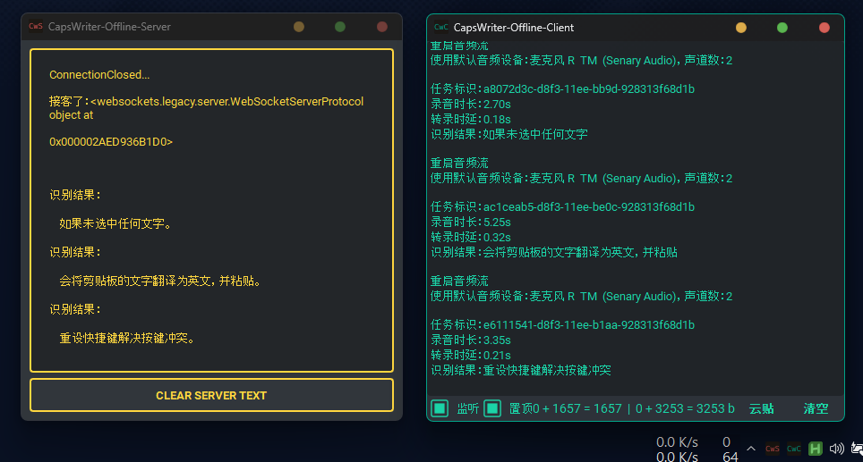
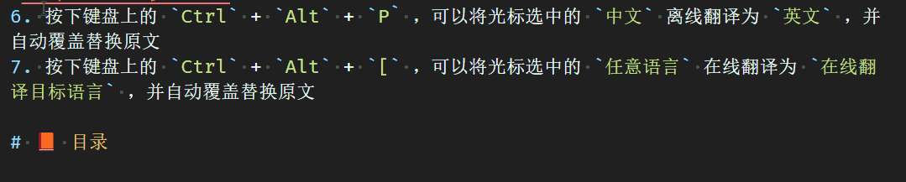
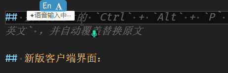
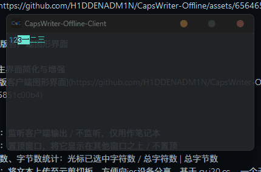
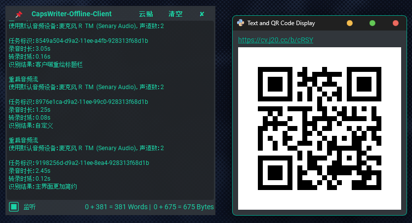
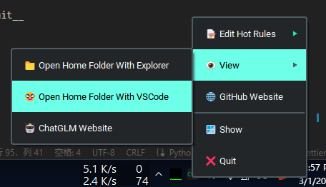

# 😘 CapsWriter-Offline 图形界面包分支 （ 仅  <span style="color: #4ABAFF;">[Windows 10+](https://www.microsoft.com/zh-cn/windows) </span> ）



#  <span style="color: #4ABAFF;">[Windows](https://www.microsoft.com/zh-cn/windows)</span> 端离线语音输入简/繁体、中译英、字幕转录；在线多译多、云剪贴板等等 （选用SenseVoice模型时 支持中粤英日韩多语种）

> [!IMPORTANT]
> 新增图形化配置界面 `edit_config_gui.exe`，可方便修改配置，但仍支持手动修改 `config.toml` 文件

## 😎 十个功能：

1. 按下键盘上的大写锁定键 `CapsLock` ，录音开始，当松开大写锁定键时，就会识别你的录音，并将识别结果立刻输入
2. 按下键盘上的 `Left Shift` 再按 `CapsLock` 可以将识别结果离线翻译为英文，并将识别结果立刻输入
3. 按下键盘上的 `Right Shift` 再按 `CapsLock` 可以将识别结果[在线翻译](https://github.com/OwO-Network/DeepLX)为多国语言，默认设置翻译为日文，并将识别结果立刻输入
4. 将音视频文件拖动到客户端 `start_client_gui.exe` 打开，即可转录生成 srt 字幕
5. 按下客户端主界面的 `云贴` 按钮，即可将客户端文本框中的前 1024 个字节发布到[云剪贴板](https://cv.j20.cc/) ，并生成获取链接和二维码
6. 按下键盘上的 `Ctrl` + `Alt` + `P` ，可以将光标选中的 `中文` [离线翻译](https://huggingface.co/Helsinki-NLP/opus-mt-zh-en)为 `英文` ，并自动覆盖替换原文
7. 按下键盘上的 `Ctrl` + `Alt` + `[` ，可以将光标选中的 `任意语言` [在线翻译](https://github.com/OwO-Network/DeepLX)为 `在线翻译目标语言` ，并自动覆盖替换原文
8. 按下键盘上的 `Ctrl` + `Alt` + `F` ，可以使用 everything 搜索光标选中的文字
9. 快速双击 `CapsLock` ，可语音输入繁体。长按 `CapsLock` 实现按键原有功能切换大写锁定。
10. 可通过 `edit_config_gui.exe` 图形化配置界面安全地修改客户端/服务端配置，也可手动修改 `config.toml` 文件

- [✨ 特性](#-特性)
- [⬇️ 下载地址](#-下载地址)
- [❗ 注意事项](#-注意事项)
- [🤓 源码运行](#-源码运行)
- [🔧 修改配置](#-修改配置)
- [🪳 提交 Bug ](https://github.com/H1DDENADM1N/CapsWriter-Offline/issues)

# 👀 最新更新

<details>
<summary><h1">展开最近更新</h1></summary>
## 新增 可选项 开始和结束任务时播放提示音
> 可在 `config.toml` 设置是否启用，以及音频文件路径和音量。需要ffplay.exe
> ffplay.exe 来自 https://www.gyan.dev/ffmpeg/builds/
> start.mp3 和 stop.mp3 音频文件来自 https://pixabay.com

## 新增 可选项 切换模型 `Sensevoice` 或 `Paraformer`

> Sensevoice模型虽然多了粤英日韩多语种，但是，中文识别效果大不如Paraformer模型
> 比如转录字幕不完整，识别结果不准确、丢失标点等
> 如果你只说中文普通话，建议使用 'Paraformer' 模型
> 不影响简繁转换和翻译

## 新增 可选项 通过注册表/按键判断是否语音输入中

## 新增 可选项 是否启用离在线翻译和状态提示
> start_online_translate_server = True # 启用在线翻译服务
> start_offline_translate_server = True # 启用离线翻译服务
> 
> use_offline_translate_function = True # 启用离线翻译相关快捷键
> use_online_translate_function = True # 启用在线翻译相关快捷键
> 
> hint_while_recording_at_edit_position_powered_by_ahk = True  # 是否启用 基于AHK的 输入光标位置的输入状态提示功能


## 重写hint_while_recording.exe，实现更加精准的输入光标位置提示
不再是监测按键的伪状态，而是由Python(win32gui.PostMessage)将语音输入状态传递给AHK(hwnd)

## 双击`录音键`临时转换 `简/繁` 体中文输出，可在 `config.toml` 设置 `简/繁` 中文作为主要输出 (@JoanthanWu)

## 更美观的“语音输入中”提示，可在 `hint_while_recording.ini` 设置文本内容、颜色、排除列表等 (@JoanthanWu)
> 
> 


## 按下键盘上的 `Ctrl` + `Alt` + `P` ，可以将光标选中的 `中文` 离线翻译为 `英文` ，并自动覆盖替换原文

## 按下键盘上的 `Ctrl` + `Alt` + `[` ，可以将光标选中的 `任意语言` 在线翻译为 `在线翻译目标语言` （ `config.toml` `online_translate_target_languages` ），并自动覆盖替换原文

> 

## 按下键盘上的 `Ctrl` + `Alt` + `F` ，可以使用 everything 搜索光标选中的文字

> 

## 跟随鼠标光标位置的新版输入状态提示功能可在 `config.toml` 设置禁用

> 

## 新版客户端界面：

> - 透明；极简
> - `Ctrl+鼠标滚轮` 可调整字体大小
> - 标题栏和操作栏失去光标焦点时自动隐藏
> - 窗口贴边自动隐藏
> - 无任务栏图标
>
> 
>
> > 标题栏
> >
> > - 📌：置顶窗口，将它显示在其他窗口之上 / 不置顶
> > - 云贴：按下客户端主界面的 `云贴` 按钮，即可将客户端文本框中的前 1024 个字节发布到[云剪贴板](https://cv.j20.cc/)（一个无依赖即用即走的剪切板） ，并生成获取链接和二维码。实测 5~1024 字节，不足字节补.超出字节无效。
> >   
> > - 清空：清空文本框中的全部内容
>
> > 操作栏
> >
> > - 监听：监听客户端输出 / 不监听，仅用作笔记本
> > - 字符数、字节数统计：光标已选中字符数 / 总字符数 | 字节数

## 新版客户端托盘图标右键菜单：

> 

</details>

---

# ✨ 特性

1. 基于 [PySide6](https://pypi.org/project/PySide6/) 的 GUI，服务端 `start_server_gui.exe` 默认使用 [Qt-Material](https://github.com/UN-GCPDS/qt-material) dark_yellow 主题，客户端 `start_client_gui.exe` 默认使用 [Qt-Material](https://github.com/UN-GCPDS/qt-material) dark_teal 主题；基于 [PyStand](https://github.com/skywind3000/PyStand) 绿化便携 `exe`
2. 完全离线、无限时长、低延迟、高准确率、中英混输、中译英、自动阿拉伯数字、自动调整中英间隔
3. 防干扰功能：默认录音时静音并暂停其他音频播放，避免音乐干扰语音输入，通过 `config.toml` 中 `mute_other_audio` 和 `pause_other_audio` 配置
4. 离线翻译功能：离线翻译模型[Helsinki-NLP/opus-mt-zh-en](https://huggingface.co/Helsinki-NLP/opus-mt-zh-en) ，组合键 按住 `Left Shift` 再按 `CapsLock` 进行翻译，方便同时需要输入中文和英文翻译的场景。通过 `config.toml` 中 `offline_translate_shortcut` 配置
5. 在线翻译功能：基于 [DeepLX](https://github.com/OwO-Network/DeepLX) 可以将识别结果在线翻译为多国语言，默认翻译为日文。过于频繁的请求可能导致 IP 被封。组合键 按住 `Right Shift` 再按 `CapsLock` 进行翻译，方便同时需要输入中文和英文翻译的场景。通过 `config.toml` 中 `online_translate_shortcut` 和 `trans_online_target_languages` 配置
6. 转录功能：将音视频文件拖动到客户端 `start_client_gui.exe` 打开，即可转录生成 srt 字幕
7. 热词功能：可以在 `hot-en.txt hot-zh.txt hot-rule.txt` 中添加三种热词，客户端动态载入
8. 日记功能：默认每次录音识别后，识别结果记录在 `年份/月份/日期.md` ，录音文件保存在 `年份/月份/assets`
9. 关键词日记：识别结果若以关键词开头，会被记录在 `年份/月份/关键词-日期.md`，关键词在 `keywords.txt` 中定义
10. 服务端、客户端分离，可以服务多台客户端
11. 编辑 `config.toml` ，可以配置服务端地址、快捷键、录音开关……
12. 支持最小化到系统托盘
13. 已包含所有 Python 环境和 models 模型，解压即用
14. 输入状态提示功能：按下 `Capslock` 键会在光标处提示 [✦ 语音输入中‧‧‧](https://github.com/HaujetZhao/CapsWriter-Offline/issues/52#issuecomment-1905758203)；按下 `Shift` 和 `Capslock` 键会在光标处提示 [✦VoiceTrans‧‧‧](https://github.com/HaujetZhao/CapsWriter-Offline/issues/52#issuecomment-1905758203)。注意此功能由 [AutoHotKeyV2](https://www.autohotkey.com/download/) `hint_while_recording.exe` 实现，修改 `config.toml` 默认快捷键并**不会**改变提示的按键设置，需要编辑 `hint_while_recording.ahk` 并自行编译替换 `hint_while_recording.exe`
15. 输入状态提示功能 V2：按下 `Capslock` 键会在跟随鼠标指针处提示一个小麦克风图标。默认启用，通过 `config.toml` 中 `hint_while_recording_at_cursor_position` 配置
16. 阿拉伯数字化年份功能：默认将\***\*年 大写汉字替换为阿拉伯数字\*\***年，例如一八四八年 替换为 1848 年。通过 `config.toml` 中 `Arabic_year` 配置
17. 启动后自动缩小至托盘功能：默认 服务端 `start_server_gui.exe` 启动后不显示主窗口，自动缩小至托盘；客户端 `start_client_gui.exe` 显示主窗口。通过 `config.toml` 中 `shrink_automatically_to_tray` 配置
18. 禁止多开功能：默认禁止多开，通过 `config.toml` 中 `only_run_once` 配置
19. 一键启动功能：默认服务端 `start_server_gui.exe` 启动后，自动 **🛡️ 以管理员权限** 启动客户端 `start_client_gui_admin.exe`，通过 `config.toml` 中 `in_the_meantime_start_the_client_and_run_as_admin` 和 `In_the_meantime_start_the_client_as_admin` 配置
20. 将文本上传至云剪切板，方便向 ios 设备分享。基于 [cv.j20.cc]() ，一个无依赖即用即走的剪切板。实测 5~1024 字节，不足字节补 `.` ，超出字节 `无效` 。
21. 将光标选中了中文离线翻译功能：按下 `Ctrl` + `Alt` + `P` ，可以将光标选中了中文离线翻译为英文，并自动覆盖替换原文。通过 `config.toml` 中 `offline_translate_and_replace_the_selected_text_shortcut` 配置
22. 按下键盘上的 `Ctrl` + `Alt` + `[` ，可以将光标选中的 `任意语言` 在线翻译为 `在线翻译目标语言` ，并自动覆盖替换原文。通过 `config.toml` 中 `online_translate_and_replace_the_selected_text_shortcut` 和 `online_translate_target_languages` 配置
23. 默认启用双击`录音键`临时转换 `简/繁` 体中文输出的功能，通过 `config.toml` 中 `enable_double_click_opposite_state` 配置
24. 默认使用简体中文作为主要输出，快速双击输出繁体中文。设置 `config.toml` 中 `convert_to_traditional_chinese_main = '繁'` 可以默认使用繁体中文，双击输出简体中文

# 🪳 无力解决的 Bug

1. 在多屏幕状态，贴边隐藏位置错乱
2. 在多屏幕状态，跟随鼠标光标位置的新版输入状态位置错乱。

# ⬇️ 下载地址

- 123 盘：https://www.123pan.com/s/qBxUVv-H4Zq3.html 提取码:h8vb
- GitHub Release: [Releases · H1DDENADM1N/CapsWriter-Offline](https://github.com/H1DDENADM1N/CapsWriter-Offline/releases)


# ❗ 注意事项

1. 存在杀毒误报，建议关闭杀毒软件和防火墙，再解压
2. 建议先不要修改默认配置，测试能否正常运行
3. 音视频文件转录功能依赖于 `FFmpeg`，打包版本已内置 `FFmpeg`
4. 默认的快捷键是 `caps lock`，你可以打开 `core_client.py` 进行修改
5. 输入状态提示功能由 [AutoHotKeyV2](https://www.autohotkey.com/download/) `hint_while_recording.exe` 实现，修改 `config.toml` 默认快捷键并**不会**改变提示的按键设置，需要编辑 `hint_while_recording.ahk` 并自行编译替换 `hint_while_recording.exe`
6. 在线翻译基于 [DeepLX](https://github.com/OwO-Network/DeepLX) ，过于频繁的请求可能导致 IP 被封，如果出现 429 错误，则表示你的 IP 被 DeepL 暂时屏蔽了，请不要在短时间内频繁请求
7. 当某程序以管理员权限运行，可能会出现有识别结果但是却无法在那个程序输入文字的状况，例如：`Listary` 、`PixPin` 等。这是因为 `start_client_gui.exe` 默认以用户权限运行客户端，运行在用户权限的程序无法控制管理员权限的程序。你可以关闭用户权限运行的客户端，尝试使用 `start_client_gui_admin.exe` 以管理员权限运行客户端
8. 添加开机自启动的方法：

   8.1 如果你未更改默认配置（ `In_the_meantime_start_the_client = True` 表示一键启动功能 生效，服务端会自动启动客户端），只用新建 `start_server_gui.exe` 的快捷方式，将服务端的快捷方式放到 `shell:startup` 目录下即可在开机时自动启动服务端和客户端。服务端会自动启动客户端。不要添加客户端的快捷方式。

   8.1.1 如果你未更改默认配置（ `In_the_meantime_start_the_client_as_admin = True` ），启动服务端会自动以管理员权限启动客户端。

   8.1.2 如果你更改了默认配置（ `In_the_meantime_start_the_client_as_admin = False` ），启动服务端会自动以用户权限启动客户端。

   8.2 如果你更改了默认配置（ `In_the_meantime_start_the_client = False` 表示一键启动功能 禁用，启动服务端不会启动客户端），新建 `start_server_gui.exe` 的快捷方式，将服务端的快捷方式放到 `shell:startup` 目录下只会在开机时自动启动服务端。客户端不会被启动。

   8.3 如果你更改了默认配置（ `In_the_meantime_start_the_client = False` ），新建 `start_client_gui.exe` 的快捷方式，将客户端的快捷方式放到 `shell:startup` 目录下只会在开机时自动启动客户端。服务端不会被启动。不要再添加客户端 `start_client_gui_admin.exe` 的快捷方式。

   8.4 如果你更改了默认配置（ `In_the_meantime_start_the_client = False` ），新建 `start_client_gui_admin.exe` 的快捷方式，将客户端的快捷方式放到 `shell:startup` 目录下只会在开机时自动以管理员权限启动客户端。服务端不会被启动。不要再添加客户端 `start_client_gui.exe` 的快捷方式。

9. `🤓 Open Home Folder With VSCode ` 使用前需在 `config.toml` 配置 `vscode_exe_path`
10. 输入状态指示位置错乱如何解决？
    10.1 通过 `config.toml` 中 `hint_while_recording_at_cursor_position` 配置禁用跟随鼠标光标位置的麦克风形状的输入状态提示；

    10.2 通过重命名或删除 `hint_while_recording.exe` 完全不启用输入光标位置的“✦语音输入中‧‧‧”文字状态提示

    10.3 通过 `hint_while_recording.ini` 中 `hintAtCursorPositionList` 配置将部分程序的输入光标位置的“✦语音输入中‧‧‧”文字状态提示显示到鼠标光标位置

    10.4 通过 `hint_while_recording.ini` 中 `doNotShowHintList` 配置禁用部分程序的输入光标位置的“✦语音输入中‧‧‧”文字状态提示

    10.5 欢迎将位置错乱的exe程序名反馈给我

# 🤓 源码运行

1. 运行 `.\runtime\python.exe .\core_server.py` 脚本 在终端启动服务端，会载入 SenseVoice 模型识别模型 或Paraformer 模型和标点模型（通过`config.toml` `model = 'Sensevoice' # 'Sensevoice' 或 'Paraformer'` 配置。这会占用 2GB 的内存，载入时长约 50 秒）
2. 运行 `.\runtime\python.exe .\core_client.py` 脚本 在终端启动客户端，会载入中译英模型，打开系统默认麦克风，开始监听按键（这会占用 400MB 的内存，载入时长约 20 秒）
3. 按住 `CapsLock` 键，录音开始，松开 `CapsLock` 键，录音结束，识别结果立马被输入（录音时长短于 0.3 秒不算）
4. 按住 `Left Shift` 再按 `CapsLock` 进行离线翻译，方便同时需要输入中文和英文翻译的场景
5. 按住 `Right Shift` 再按 `CapsLock` 进行在线翻译，方便同时需要输入中文和英文翻译的场景

---

# 🔧 修改配置

你可以使用 `edit_config_gui.exe` 图形界面工具方便且安全地修改 服务端、客户端的配置，也可以直接编辑 `config.toml` ，在开头部分有注释，指导你修改服务端、客户端的：

```toml
# ======================服务端配置==================================
[server]
model = "Sensevoice"
# 'Sensevoice' 或 'Paraformer'
# Sensevoice模型虽然多了粤英日韩多语种，但是，中文识别效果大不如Paraformer模型
# 比如转录字幕不完整，识别结果不准确、丢失标点等
# 如果你只说中文普通话，建议使用 'Paraformer' 模型
# 不影响简繁转换和翻译

addr = "0.0.0.0"
# 服务端监听地址

speech_recognition_port = "6016"
# 语音识别服务端口

start_online_translate_server = true
# 是否启用在线翻译服务

start_offline_translate_server = true
# 是否启用离线翻译服务

offline_translate_port = "6017"
# 离线翻译服务端口

format_num = true
# 是否将中文数字转为阿拉伯数字

format_punc = true
# 使用 'Paraformer' 模型时，输出时是否启用标点符号引擎

format_spell = true
# 是否调整中英之间的空格

shrink_automatically_to_tray = true
# 启动后是否自动缩小至托盘

only_run_once = true
# 只允许运行一次，禁止多开

in_the_meantime_start_the_client = true
# 启动服务端时是否同时启动客户端

in_the_meantime_start_the_client_and_run_as_admin = true
# 启动服务端的同时以管理员权限启动客户端
# 当某程序以管理员权限运行
# 可能会出现有识别结果但是却无法在那个程序输入文字的状况
# 例如：Listary、PixPin等
# 这是因为 start_client_gui.exe 默认以用户权限运行客户端
# 运行在用户权限的程序无法控制管理员权限的程序
# 你可以关闭用户权限运行的客户端
# 尝试使用 start_client_gui_admin.exe
# 以管理员权限运行客户端


# ======================客户端配置==================================

[client]
addr = "127.0.0.1"
# 要连接的服务端地址

speech_recognition_port = "6016"
# 语音识别服务端口

offline_translate_port = "6017"
# 离线翻译服务端口

offline_translate_port_gemma2b = "11434"
# Gemma 2B 离线翻译端口

speech_recognition_shortcut = "caps lock"
# 控制录音的快捷键，默认是 "caps lock"

use_offline_translate_function = true
# 是否启用离线翻译功能

offline_translate_shortcut = "left shift"
# 控制离线翻译的快捷键，默认是 "left shift"，按住 Left Shift 再按 CapsLock 进行离线翻译

offline_translate_and_replace_the_selected_text_shortcut = "ctrl + alt + p"
# 控制离线翻译将光标选中的中文翻译并替换为英文的快捷键
# 如果未选中任何文字，会将剪贴板的文字翻译为英文并粘贴

use_online_translate_function = true
# 是否启用在线翻译功能

online_translate_shortcut = "right shift"
# 控制在线翻译的快捷键，默认是 Right Shift，按住 Right Shift 再按 CapsLock 进行在线翻译
# 在线翻译基于 DeepLX，过于频繁的请求可能导致 IP 被封
# 如果出现 429 错误，则表示你的 IP 被 DeepL 暂时屏蔽了，请不要在短时间内频繁请求

online_translate_target_languages = "JA"
# 在线翻译目标语言
# 常用的 EN JA RU，更多选择参考 https://www.deepl.com/docs-api/translate-text

online_translate_and_replace_the_selected_text_shortcut = "ctrl + alt + ["
# 控制在线翻译将光标选中的中文翻译并替换为在线翻译目标语言的快捷键
# 如果未选中任何文字，会将剪贴板的文字翻译为目标语言并粘贴

use_search_selected_text_with_everything_function = true
# 是否启用使用 Everything 搜索选中文字的功能

search_selected_text_with_everything_shortcut = "ctrl + alt + f"
# 调用 Everything 搜索光标选中的字符
# 使用前需先安装 Everything，https://www.voidtools.com/zh-cn/downloads/

everything_exe_path = "C:\\Program Files\\Everything\\Everything.exe"
# 设置 Everything 可执行文件位置

hold_mode = true
# 长按模式，按下录音，松开停止，像对讲机一样用
# 改为 False，则关闭长按模式，也就是单击模式
# 即：单击录音，再次单击停止
# 且：长按会执行原本的单击功能

suppress = false
# 是否阻塞按键事件（让其它程序收不到这个按键消息）

restore_key = true
# 录音完成，松开按键后，是否自动再按一遍，以恢复 CapsLock 或 Shift 等按键之前的状态

threshold = 0.3
# 按下快捷键后，触发语音识别的时间阈值

paste = true
# 是否以写入剪切板然后模拟 Ctrl-V 粘贴的方式输出结果

restore_clipboard_after_paste = true
# 模拟粘贴后是否恢复剪贴板

save_audio = true
# 是否保存录音文件

save_markdown = true
# 是否将记录写入 Markdown 文件

audio_name_len = 20
# 将录音识别结果的前多少个字存储到录音文件名中，建议不要超过 200

reduce_audio_files = true
# 如果用户已安装 ffmpeg，调用 ffmpeg 录音时输出 mp3 格式的音频文件，大大减小文件体积，减少磁盘占用

trash_punc = "，。,."
# 识别结果要消除的末尾标点

hot_zh = true
# 是否启用中文热词替换，中文热词存储在 hot_zh.txt 文件里

"多音字" = true
# True 表示多音字匹配

"声调" = false
# False 表示忽略声调区别，这样「黄章」就能匹配「慌张」

hot_en = true
# 是否启用英文热词替换，英文热词存储在 hot_en.txt 文件里

hot_rule = true
# 是否启用自定义规则替换，自定义规则存储在 hot_rule.txt 文件里

hot_kwd = true
# 是否启用关键词日记功能，自定义关键词存储在 keyword.txt 文件里

mic_seg_duration = 15
# 麦克风听写时分段长度：15 秒

mic_seg_overlap = 2
# 麦克风听写时分段重叠：2 秒

file_seg_duration = 25
# 转录文件时分段长度：25 秒

file_seg_overlap = 2
# 转录文件时分段重叠：2 秒

mute_other_audio = true
# 录音时是否静音其他音频播放

pause_other_audio = true
# 录音时是否暂停其他音频播放

arabic_year_number = true
# 将 ****年 大写汉字替换为阿拉伯数字 ****年，例如一八四八年 替换为 1848 年

shrink_automatically_to_tray = false
# 启动后是否自动缩小至托盘

only_run_once = true
# 只允许运行一次，禁止多开

only_enable_microphones_when_pressed_record_shortcut = true
# 只在按下录音快捷键时启用麦克风
# 建议启用，有些蓝牙耳机录音时无法播放
# 而且启用后，切换默认麦克风也不用重启客户端
# 比如从蓝牙耳机换回笔记本电脑默认麦克风
# 缺点就是输入的时候可能会慢些
# 毕竟要先建立与麦克风的连接

vscode_exe_path = "C:\\SSS\\VSCode\\Code - Insiders.exe"
# 设置 VSCode 可执行文件位置
# 用于通过客户端托盘图标右键菜单项 View 子菜单项
# 🤓 Open Home Folder With VSCode
# 使用 VSCode 快速打开 CapsWriter 主目录
# 方便调试

play_start_music = true
# 开始任务时是否播放提示音
# 需要 ffplay.exe

start_music_path = "assets/start.mp3"
# 开始任务提示音的文件路径

start_music_volume = "100"
# 开始任务提示音的音量，0 ~ 100 之间

play_stop_music = true
# 结束任务时是否播放提示音
# 需要 ffplay.exe

stop_music_path = "assets/stop.mp3"
# 结束任务提示音的文件路径

stop_music_volume = "50"
# 结束任务提示音的音量，0 ~ 100 之间

hint_while_recording_at_edit_position_powered_by_ahk = true
# 是否启用基于 AHK 的输入光标位置的输入状态提示功能

hint_while_recording_at_cursor_position = true
# 是否启用跟随鼠标光标位置的新版输入状态提示功能

check_microphone_usage_by = "注册表"
# "按键" 或 "注册表"
# 默认通过监测注册表判断麦克风是否在被客户端使用进而确定是否在录音
# 如果设置了 `only_enable_microphones_when_pressed_record_shortcut = False`
# 会造成的鼠标光标旁边永远显示麦克风标志
# 将强制忽略此项设置使用 "按键"
# "按键" 是通过监测 `speech_recognition_shortcut` 状态是否按下进而推测是否在录音

enable_double_click_opposite_state = true
# 是否启用双击 `录音键` 临时转换 `简/繁` 体中文输出的功能

convert_to_traditional_chinese_main = "简"
# `简/繁` 中文作为主要输出

opencc_converter = "s2t.json"
# OpenCC 转换器
# s2t.json Simplified Chinese to Traditional Chinese 简体到繁体
# t2s.json Traditional Chinese to Simplified Chinese 繁体到简体
# s2tw.json Simplified Chinese to Traditional Chinese (Taiwan Standard) 简体到台湾正体
# tw2s.json Traditional Chinese (Taiwan Standard) to Simplified Chinese 台湾正体到简体
# s2hk.json Simplified Chinese to Traditional Chinese (Hong Kong Standard) 简体到香港繁体（香港小学学习字词表标准）
# hk2s.json Traditional Chinese (Hong Kong Standard) to Simplified Chinese 香港繁体（香港小学学习字词表标准）到简体
# s2twp.json Simplified Chinese to Traditional Chinese (Taiwan Standard) with Taiwanese idiom 简体到繁体（台湾正体标准）并转换为台湾常用词汇
# tw2sp.json Traditional Chinese (Taiwan Standard) to Simplified Chinese with Mainland Chinese idiom 繁体（台湾正体标准）到简体并转换为中国大陆常用词汇
# t2tw.json Traditional Chinese (OpenCC Standard) to Taiwan Standard 繁体（OpenCC 标准）到台湾正体
# t2hk.json Traditional Chinese (OpenCC Standard) to Hong Kong Standard 繁体（OpenCC 标准）到香港繁体（香港小学学习字词表标准）
# t2jp.json Traditional Chinese Characters (Kyūjitai) to New Japanese Kanji (Shinjitai) 繁体（OpenCC 标准，旧字体）到日文新字体
# jp2t.json New Japanese Kanji (Shinjitai) to Traditional Chinese Characters (Kyūjitai) 日文新字体到繁体（OpenCC 标准，旧字体）


# ======================DeepLX 配置==================================

[deeplx]
online_translate_port = "1188"
# DeepLX 在线翻译服务端口

exe_path = "deeplx_windows_amd64.exe"
# DeepLX 可执行文件路径

api = "http://127.0.0.1:1188/translate"
# DeepLX API 地址


# ======================模型路径配置==================================

[model_paths]
model_dir = "models"
# 模型文件目录

sensevoice_path = "models/sherpa-onnx-sense-voice-zh-en-ja-ko-yue-2024-07-17/model.int8.onnx"
# SenseVoice 模型路径

sensevoice_tokens_path = "models/sherpa-onnx-sense-voice-zh-en-ja-ko-yue-2024-07-17/tokens.txt"
# SenseVoice tokens 路径

paraformer_path = "models/paraformer-offline-zh/model.int8.onnx"
# Paraformer 模型路径

paraformer_tokens_path = "models/paraformer-offline-zh/tokens.txt"
# Paraformer tokens 路径

punc_model_dir = "models/punc_ct-transformer_cn-en"
# 标点模型目录

opus_mt_dir = "models/Helsinki-NLP--opus-mt-zh-en"
# 离线翻译模型目录


# ======================SenseVoice 参数配置==================================

[sensevoice_args]
model = "${model_paths.sensevoice_path}"
# SenseVoice 模型路径

tokens = "${model_paths.sensevoice_tokens_path}"
# SenseVoice tokens 路径

num_threads = 6
# 使用的线程数

sample_rate = 16000
# 采样率

feature_dim = 80
# 特征维度

decoding_method = "greedy_search"
# 解码方法

debug = false
# 是否启用调试模式

provider = "cpu"
# 推理设备（cpu, cuda, coreml）

language = "auto"
# 识别语言（auto, zh, en, ja, ko, yue）

use_itn = true
# 是否使用逆文本归一化

rule_fsts = ""
# 自定义规则 FST 文件路径

rule_fars = ""
# 自定义规则 FAR 文件路径


# ======================Paraformer 参数配置==================================

[paraformer_args]
paraformer = "${model_paths.paraformer_path}"
# Paraformer 模型路径

tokens = "${model_paths.paraformer_tokens_path}"
# Paraformer tokens 路径

num_threads = 6
# 使用的线程数

sample_rate = 16000
# 采样率

feature_dim = 80
# 特征维度

decoding_method = "greedy_search"
# 解码方法

debug = false
# 是否启用调试模式

```

你可以直接编辑 `hint_while_recording.ini` 文件，修改“✦语音输入中‧‧‧”提示的配置

```ini
[BeautifulToolTip]
enableBTT=1
[ShowText]
cnTxt=✦语音输入中‧‧‧
cnTxtB=✦语音输入中⇄
enTxt=✦VoiceTrans‧‧‧
enTxtB=✦VoiceTrans⇄
[Txt]
cnTxtClolorA=0xFFCC7A00
cnTxtClolorB=0xFFFFDF80
cnTxtFontSize=16
enTxtClolorA=0xFF1A1AFF
enTxtClolorB=0xFF6666FF
enTxtFontSize=16
[List]
Comment1=在hintAtCursorPositionList中的程序将不会把“语音输入中”的提示显示在文本光标位置，而是显示在鼠标光标的位置
hintAtCursorPositionList=:StartMenuExperienceHost.exe:wetype_update.exe:AnLink.exe:wps.exe:HBuilderX.exe:ShareX.exe:clipdiary-portable.exe:explorer.exe:
Comment2=在doNotShowHintList中的程序将不会显示“语音输入中”的提示
doNotShowHintList=:PotPlayer.exe:PotPlayer64.exe:PotPlayerMini.exe:PotPlayerMini64.exe:
```

# 🔧 功能：热词

如果你有专用名词需要替换，可以加入热词文件。规则文件中以 `#` 开头的行以及空行会被忽略，可以用作注释。

- 中文热词请写到 `hot-zh.txt` 文件，每行一个，替换依据为拼音，实测每 1 万条热词约引入 3ms 延迟
- 英文热词请写到 `hot-en.txt` 文件，每行一个，替换依据为字母拼写
- 自定义规则热词请写到 `hot-rule.txt` 文件，每行一个，将搜索和替换词以等号隔开，如 `毫安时  =  mAh`

你可以在 `core_client.py` 文件中配置是否匹配中文多音字，是否严格匹配拼音声调。

检测到修改后，客户端会动态载入热词，效果示例：

1. 例如 `hot-zh.txt` 有热词「我家鸽鸽」，则所有识别结果中的「我家哥哥」都会被替换成「我家鸽鸽」
2. 例如 `hot-en.txt` 有热词「ChatGPT」，则所有识别结果中的「chat gpt」都会被替换成「ChatGPT」
3. 例如 `hot-rule.txt` 有热词「毫安时 = mAh」，则所有识别结果中的「毫安时」都会被替换成「mAh」


# 🔧 功能：日记、关键词

默认每次语音识别结束后，会以年、月为分类，保存录音文件和识别结果：

- 录音文件存放在「年/月/assets」文件夹下
- 识别结果存放在「年/月/日.md」Markdown 文件中

例如今天是 2023 年 6 月 5 号，示例：

1. 语音输入任一句话后，录音就会被保存到 `2023/06/assets` 路径下，以时间和识别结果命名，并将识别结果保存到 `2023/06/05.md` 文件中，方便我日后查阅
2. 例如我在 `keywords.txt` 中定义了关键词「健康」，用于随时记录自己的身体状况，吃完饭后我可以按住 `CapsLock` 说「健康今天中午吃了大米炒饭」，由于识别结果以「健康」关键词开头，这条识别记录就会被保存到 `2023/06/05-健康.md` 中
3. 例如我在 `keywords.txt` 中定义了关键词「重要」，用于随时记录突然的灵感，有想法时我就可以按住 `CapsLock` 说「重要，xx 问题可以用 xxxx 方法解决」，由于识别结果以「重要」关键词开头，这条识别记录就会被保存到 `2023/06/05-重要.md` 中


# 🔧 功能：转录文件

在服务端运行后，将音视频文件拖动到客户端打开，即可转录生成四个同名文件：

- `json` 文件，包含了字级时间戳
- `txt` 文件，包含了分行结果
- `merge.txt` 文件，包含了带标点的整段结果
- `srt` 文件，字幕文件

如果生成的字幕有微小错误，可以在分行的 `txt` 文件中修改，然后将 `txt` 文件拖动到客户端打开，客户端检测到输入的是 `txt` 文件，就会查到同名的 `json` 文件，结合 `json` 文件中的字级时间戳和 `txt` 文件中修正结果，更新 `srt` 字幕文件。

---

# ⬇️ 模型下载链接

## 语音识别

### Sensevoice

[sensevoice模型](https://k2-fsa.github.io/sherpa/onnx/sense-voice/pretrained.html#sherpa-onnx-sense-voice-zh-en-ja-ko-yue-2024-07-17)

### Paraformer

[sherpa-onnx](https://k2-fsa.github.io/sherpa/onnx/index.html) ，载入阿里巴巴开源的 [Paraformer](https://www.modelscope.cn/models/damo/speech_paraformer-large-vad-punc_asr_nat-zh-cn-16k-common-vocab8404-pytorch) 模型（[转为量化的 onnx 格式](https://k2-fsa.github.io/sherpa/onnx/pretrained_models/offline-paraformer/paraformer-models.html)），来作语音识别，整个模型约 230MB 大小。下载有已转换好的模型文件：

- [yiyu-earth/sherpa-onnx-paraformer-zh-2024-04-25](https://huggingface.co/yiyu-earth/sherpa-onnx-paraformer-zh-2024-04-25)

另外，还使用了阿里巴巴的标点符号模型，大小约 1GB：

- [CT-Transformer 标点-中英文-通用-large-onnx](https://www.modelscope.cn/models/damo/punc_ct-transformer_cn-en-common-vocab471067-large-onnx/summary)

## 离线翻译

中译英模型 [Helsinki-NLP/opus-mt-zh-en](https://huggingface.co/Helsinki-NLP/opus-mt-zh-en)

- [opus-2020-07-17.zip](https://object.pouta.csc.fi/Tatoeba-MT-models/zho-eng/opus-2020-07-17.zip)


# 🤩 都看到这儿了，给个星星好不好？ ⭐

<details>
<summary><h1">了解更多</h1></summary>

# 🪙 打赏

## 🪙 打赏原版 [CapsWriter-Offline](https://github.com/HaujetZhao/CapsWriter-Offline)

如果你愿意，可以打赏的方式支持原版[CapsWriter-Offline](https://github.com/HaujetZhao/CapsWriter-Offline)作者一下：

> 

## 🪙 打赏图形界面版 [CapsWriter-Offline](https://github.com/H1DDENADM1N/CapsWriter-Offline)

## 感谢你的好意 💖，不过，暂时不必。点个Star⭐，提点🪳Issues，让我知道有人在用，这比金钱更能使我高兴。

---

## [Pywin32](https://github.com/mhammond/pywin32) 打包进 Embedded Python 的方法

本机 Python3.11.8 执行

```
pip install  --target .\site-packages pywin32
```

编辑 `.\runtime\python311._pth` 增加

```
../site-packages/win32
../site-packages/win32/lib
../site-packages/win32ctypes/pywin32
../site-packages/win32ctypes
```

复制 `.\site-packages\pywin32_system32\` 中的 `*.dll` 到 `.\runtime\`

# siui
## [PySide6-SiliconUI](https://github.com/H1DDENADM1N/PySide6-SiliconUI)

## [PyQt-SiliconUI](https://github.com/ChinaIceF/PyQt-SiliconUI)

</details>